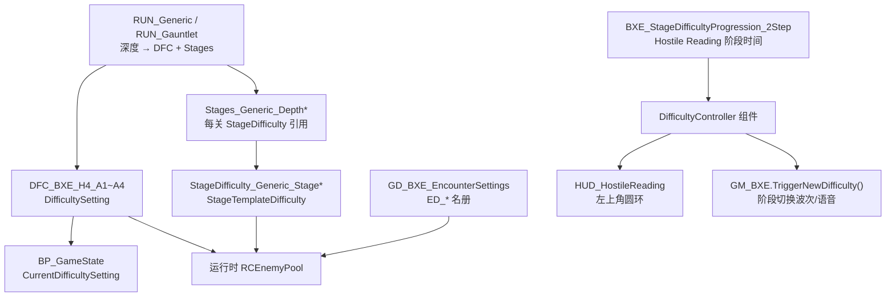

# RogueCore 难度配置分析

> 游戏资源路径：`/Users//Project/RogueCore`  
> Mappings：`maps/RogueCore-5.6.1-140986+main-0196ef29.usmap`  
> UE 版本：`VER_UE5_6`  
> 分析产物：`UAssetStudio/analysis/rc_enemy_pool/`、`UAssetStudio/analysis/rc_timer/`

## 概述

RogueCore 的「难度」**不是单一配置文件**，而是由多层 DataAsset 在任务开始时绑定、在运行时由 C++ `DifficultyController` 与 Blueprint 协同推进。

| 层级 | 类型 | 管什么 | 不管什么 |
|------|------|--------|----------|
| **DifficultySetting**（`DFC_*`） | 深度级基础难度 | 怪物池规模、波次间隔、数量曲线 | 怪物种类、关卡结构 |
| **StageTemplateDifficulty**（`StageDifficulty_*`） | 关卡阶段修正 | 单关敌人数量/伤害/抗性、Special/Disruptive 计数 | 阶段时间、Hostile Reading |
| **StageDifficultyProgression**（`BXE_StageDifficultyProgression_*`） | Hostile Level 阶段 | Low → Insane(Red) 时间、预警、Red 惩罚资源 | 单关数值修正 |
| **EncounterSettings** | 怪物名册 | 哪些 `ED_*` 可进池 | 难度倍率 |

常见误区：

- **不存在**名为 `Difficulty.uasset` 或 `RCDifficulty.uasset` 的总入口。
- `DNA_BXE_Linear_*` 定义关卡结构（阶段数、房间标签），**不含**难度数值。
- `GD_BXE_ProgressionSettings` 是玩家账号 **XP 升级**，与任务内敌人强度无关（详见 [`account-xp-progression.md`](./account-xp-progression.md)）。
- 任务选择 UI 的 Short/Long 标签（`MD_Duration_*`）与 Hostile Reading 计时无关。

---

## 架构与数据流

```
任务开始（RUN_Generic / RUN_Gauntlet + 深度）
  → BaseDifficultyDepthN → DFC_BXE_H4_AN
  → StageLayoutForDepthN → Stages_Generic_DepthN
    → 每 Stage 的 StageDifficulty → StageDifficulty_Generic_Stage*
  → BP_GameState.CurrentDifficultySetting（运行时当前 DFC）
  → DifficultyController.StageDifficultyProgression → BXE_StageDifficultyProgression_2Step
  → 组装 RCEnemyPool（结合 GD_BXE_EncounterSettings 名册）
  → EWC_RC_* 波次 / GM_BXE.TriggerNewDifficulty()
```



---

## 一、基础难度（DifficultySetting / DFC）

### 1.1 资产位置

**路径：** `Content/GameElements/Difficulty/`

| 资产 | 用途 |
|------|------|
| `DFC_BXE_H4_A1.uasset` ~ `A4.uasset` | 普通 Run 深度 1~4 基础难度 |
| `CRV_BXE_Stepped_EnemyCountScaleOverTime.uasset` | 随任务时间阶梯放大敌人数量（挂于 `DifficultyController`） |
| `LEGACY/DFC_Tutorial.uasset` | 教程 Run |
| `Gauntlet/DFC_BXE_Gauntlet_H4_A3.uasset` | Gauntlet 普通 |
| `Gauntlet/DFC_BXE_Gauntlet_H4_Elite.uasset` | Gauntlet Elite |

类型：`DifficultySetting`（`/Script/RogueCore`）

### 1.2 Run 绑定

**路径：** `Content/GameElements/Runs/RUN_Generic.uasset`

| 字段 | 引用 |
|------|------|
| `BaseDifficultyDepth1` | `DFC_BXE_H4_A1` |
| `BaseDifficultyDepth2` | `DFC_BXE_H4_A2` |
| `BaseDifficultyDepth3` | `DFC_BXE_H4_A3` |
| `BaseDifficultyDepth4` | `DFC_BXE_H4_A4` |
| `StageLayoutForDepth1~4` | `Stages_Generic_Depth1~4` |

Gauntlet 见 `RUN_Gauntlet.uasset` → `DFC_BXE_Gauntlet_H4_*` + `Stages_Generic_Gauntlet(_Elite)`。

### 1.3 运行时引用

**路径：** `Content/Game/BP_GameState.uasset`

- `CurrentDifficultySetting`：任务进行中当前生效的 `DifficultySetting`（默认 `DFC_BXE_H4_A1`）
- `DifficultyController` 组件：
  - `StageDifficultyProgression` → `BXE_StageDifficultyProgression_2Step`
  - `EnemyCountModifierScaleOverTime` → `CRV_BXE_Stepped_EnemyCountScaleOverTime`

`DifficultyController` 为 C++ 组件（`/Script/RogueCore.DifficultyController`），数值来自 DataAsset，阶段推进逻辑在原生代码。

### 1.4 关键字段

以已解析的 `DFC_BXE_H4_A1` / `A4` 为例：

| 字段 | A1（深度 1）示例 | A4（深度 4）示例 | 含义 |
|------|------------------|------------------|------|
| `MinPoolSize` | 7 | 7 | 运行时 RC 池最少包含的敌种类数 |
| `DisruptiveEnemyPoolCount.min` | 2 | 2 | 干扰怪在池中的最少数量 |
| `EnemyWaveInterval` | 255–330s | 165–210s | 常规大波间隔（影响 Hostile Reading 圆环波次图标密度） |
| `EnemyNormalWaveInterval` | 60–120s | 60–120s | 普通小波间隔 |
| `EnemyCountModifier` | 0.35 / 0.35 / 0.525 / 0.70 … | 0.55 / 0.55 / 0.82 / 1.10 … | 按 Hostile 阶段索引的数量倍率数组 |

深度越深，波次越密、`EnemyCountModifier` 越高；`MinPoolSize` 在 A1~A4 上当前均为 7。

---

## 二、阶段修正（StageTemplateDifficulty）

### 2.1 资产位置

**路径：** `Content/GameElements/StageDifficulty/`

| 目录 / 资产 | 用途 |
|-------------|------|
| `StageDifficulty_Generic_Stage0~5.uasset` | 普通 Run 各阶段强度 |
| `StageDifficulty_Generic_Stage0_Easy.uasset` | 简易阶段变体 |
| `Depth1/StageDifficulty_Generic_Stage1~2_DEPT1.uasset` | 深度 1 专用（Stage1/2 与全局不同） |
| `Gauntlet/StageDifficulty_Gauntlet_Stage0~6.uasset` | Gauntlet |
| `Gauntlet/EliteDifficulty/StageDifficulty_Gauntlet_Elite_Stage0~6.uasset` | Gauntlet Elite |

类型：`StageTemplateDifficulty`（`/Script/RogueCore`）

### 2.2 引用链

```
RUN_Generic.StageLayoutForDepthN
  → Stages_Generic_DepthN.uasset（RunStageLayout）
    → 每个 Stage 条目.StageDifficulty → StageDifficulty_Generic_Stage*
```

**深度 1 特殊：** `Stages_Generic_Depth1` 的 Stage1/2 使用 `Depth1/StageDifficulty_Generic_Stage*_DEPT1`，其余 Stage 仍用全局 `StageDifficulty_Generic_Stage3~5`。

**深度 2~4：** 全部使用 `StageDifficulty_Generic_Stage0~5`（无 DEPT1 变体）。

### 2.3 关键字段（以 `StageDifficulty_Generic_Stage2` 为例）

| 字段 | 示例值 | 含义 |
|------|--------|------|
| `StageEnemyCountModifier` | 1.4 | 本关敌人数量倍率 |
| `StageEnemyDamageModifier` | 1.3 | 本关敌人伤害倍率 |
| `StageResistanceModifier_SmallEnemies` | 1.2 | 小型敌人抗性倍率 |
| `StageResistanceModifier_MediumEnemies` | 1.4 | 中型敌人抗性倍率 |
| `StageResistanceModifier_LargeEnemies` | 1.5 | 大型敌人抗性倍率 |
| `DisruptiveEnemyCount` | 1 | 本关干扰怪计数修正 |
| `SpecialEnemyCount` | 2 | 本关特殊怪计数修正 |

**不含** `ED_*` 列表；只修正强度与计数，不更换怪物种类。怪物名册见 [`enemy-pool.md`](./enemy-pool.md)。

---

## 三、Hostile Reading 阶段（StageDifficultyProgression）

左上角 **Hostile Reading 圆环**（Low → Insane/Red）由独立 Progression 资产驱动，与 DFC 波次间隔、StageDifficulty 数值修正 **分工不同**。

| 资产 | 路径 | 挂载 |
|------|------|------|
| `BXE_StageDifficultyProgression_2Step.uasset` | `GameElements/Difficulty/` | `BP_GameState` → `DifficultyController` |
| `BXE_StageDifficultyProgression_Gauntlet.uasset` | 同上 | `BP_GameState_Gauntlet` |

类型：`StageDifficultyProgression`，内含 **`BXEDifficultyPoint`** 数组。

**Insane（Red）到达时间 — `TimesPerPlayerCount`（秒）：**

| 玩家人数 | 到 Red |
|----------|--------|
| 1 人 | 660s（11 分钟） |
| 2 人 | 600s（10 分钟） |
| 3 人 | 570s（9.5 分钟） |
| 4 人 | 540s（9 分钟） |

其他：`WarningTimeBeforeNextDifficulty` ≈ 120s（Red 前预警）；Low 点 `LevelLifeTime` = 25（单位需在 UE 编辑器确认）。

阶段切换时 `GM_BXE.TriggerNewDifficulty()` 触发 `WaveAtStart` 波次、阶段音乐与 Mission Control 语音；Red 后关联 `EWC_RC_EndMission_CorespawnEndless` / `EWC_RC_EndMission_CoreTentacles`。

> 完整计时系统（含电梯 60s 撤离倒计时）见 [`extraction-countdown.md`](./extraction-countdown.md)。

---

## 四、Run 与模式入口

| 资产 | 路径 | 难度相关字段 |
|------|------|--------------|
| `RUN_Generic.uasset` | `GameElements/Runs/` | `BaseDifficultyDepth1~4`、`StageLayoutForDepth1~4` |
| `RUN_Gauntlet.uasset` | `GameElements/Runs/Gauntlet/` | Gauntlet DFC + `Stages_Generic_Gauntlet(_Elite)` |
| `RUN_Tutorial.uasset` | `GameElements/Runs/` | `DFC_Tutorial` + `Stages_Tutorial` |
| `RunSettings.uasset` | `GameElements/Runs/` | 生物群系轮换（非战斗数值） |

**Stages 布局资产：**

| 资产 | 路径 |
|------|------|
| `Stages_Generic_Depth1~4.uasset` | `GameElements/Runs/Stages/` |
| `Stages_Generic_Gauntlet.uasset` | `GameElements/Runs/Gauntlet/` |
| `Stages_Generic_Gauntlet_Elite.uasset` | 同上 |
| `Stages_Tutorial.uasset` | `GameElements/Runs/Stages/` |

---

## 五、运行时 Blueprint

| 资产 | 路径 | 作用 |
|------|------|------|
| `BP_GameState.uasset` | `Content/Game/` | `CurrentDifficultySetting`、`DifficultyController` |
| `BP_GameState_Gauntlet.uasset` | 同上 | Gauntlet Progression |
| `GM_BXE.uasset` | 同上 | `EnemyWaveManager`、`TriggerNewDifficulty()` |
| `HUD_HostileReading.uasset` | `Content/UI/HUD_MainOnscreen/HostileReadings/` | 左上角圆环 UI |

**DifficultyController 关键 API：**

| API | 用途 |
|-----|------|
| `GetLevelLifeTime()` | 当前阶段相关时间 |
| `GetLevelLifeTimeForRedDifficulty()` | 到 Red 的总时间（进度条满格刻度） |
| `GetNextWaveLevelTime()` | 下一波预计时间（圆环小图标） |
| `GetStageDifficultyProgression()` → `GetDifficulties()` | 读取 `BXEDifficultyPoint` 数组 |

---

## 六、与其它系统区分

| 系统 | 配置位置 | 本文是否覆盖 |
|------|----------|--------------|
| 任务内战斗难度（DFC + StageDifficulty） | 本文 | **是** |
| Hostile Reading / Red 计时 | `BXE_StageDifficultyProgression_*` | 摘要；详见 [`extraction-countdown.md`](./extraction-countdown.md) |
| 怪物种类池 | `GD_BXE_EncounterSettings` | 否 → [`enemy-pool.md`](./enemy-pool.md) |
| 武器池 | `UP_Weapons_*` 等 | 否 → [`weapon-pool.md`](./weapon-pool.md) |
| 关卡结构（几关、房间） | `DNA_BXE_Linear_*` | 否（非难度数值） |
| 玩家账号 XP | `GD_BXE_ProgressionSettings` | 否 |
| Risk Vector 修正 | `RV_*` + Mutator | 通过 Mutator 叠加，不替换 DFC |
| 作弊改难度 UI | `UI/Menus/Menu_Cheats/Cheat_SetDifficulty*` | 调试入口，非正式平衡配置 |

---

## 七、修改目标速查

| 目标 | 修改位置 |
|------|----------|
| 深度 1~4 整体难度（池大小、波次频率、阶段数量曲线） | `DFC_BXE_H4_A1~A4` |
| 深度 1 第 1~2 关特殊强度 | `StageDifficulty/Depth1/*_DEPT1` |
| 第 N 关敌人数量/伤害/抗性 | `StageDifficulty_Generic_StageN` 或 Gauntlet 变体 |
| 随时间放大敌人数量 | `CRV_BXE_Stepped_EnemyCountScaleOverTime` + `DifficultyController` |
| Hostile Reading 到 Red 的时间 | `BXE_StageDifficultyProgression_2Step` → Insane → `TimesPerPlayerCount` |
| Red 前预警 | 同上 → `WarningTimeBeforeNextDifficulty` |
| Gauntlet 全套难度 | `RUN_Gauntlet` + `Gauntlet/` 下 DFC / StageDifficulty / Progression |
| 教程难度 | `DFC_Tutorial` + `Stages_Tutorial` |
| 增加/移除可刷怪物 | `GD_BXE_EncounterSettings`（**不是**难度倍率） |
| 改关卡层数 | `DNA_BXE_Linear_*`（**不是**难度数值） |

---

## 八、分析命令

从 UAssetStudio 根目录执行：

```bash
ASSET_ROOT="/Users//Project/RogueCore/Content"
MAPPINGS="maps/RogueCore-5.6.1-140986+main-0196ef29.usmap"
CLI="dotnet run --project UAssetStudio.Cli --"

# 基础难度（深度 1）
$CLI json "$ASSET_ROOT/GameElements/Difficulty/DFC_BXE_H4_A1.uasset" \
  --mappings "$MAPPINGS" --ue-version VER_UE5_6 \
  --out analysis/rc_timer

# Run 绑定关系
$CLI json "$ASSET_ROOT/GameElements/Runs/RUN_Generic.uasset" \
  --mappings "$MAPPINGS" --ue-version VER_UE5_6 \
  --out analysis/rc_enemy_pool

# 阶段修正
$CLI json "$ASSET_ROOT/GameElements/StageDifficulty/StageDifficulty_Generic_Stage2.uasset" \
  --mappings "$MAPPINGS" --ue-version VER_UE5_6 \
  --out analysis/rc_enemy_pool

# Stages 布局（看每关引用哪个 StageDifficulty）
$CLI json "$ASSET_ROOT/GameElements/Runs/Stages/Stages_Generic_Depth1.uasset" \
  --mappings "$MAPPINGS" --ue-version VER_UE5_6 \
  --out analysis/rc_enemy_pool

# Hostile Reading 阶段时间
$CLI json "$ASSET_ROOT/GameElements/Difficulty/BXE_StageDifficultyProgression_2Step.uasset" \
  --mappings "$MAPPINGS" --ue-version VER_UE5_6 \
  --out analysis/rc_timer

# GameState 挂载点
$CLI decompile "$ASSET_ROOT/Game/BP_GameState.uasset" \
  --mappings "$MAPPINGS" --ue-version VER_UE5_6 \
  --outdir analysis/rc_timer
```

已有分析产物示例：

| 文件 | 内容 |
|------|------|
| `analysis/rc_timer/DFC_BXE_H4_A1.json` | 深度 1 DFC 全字段 |
| `analysis/rc_timer/DFC_BXE_H4_A4.json` | 深度 4 DFC 全字段 |
| `analysis/rc_enemy_pool/StageDifficulty_Generic_Stage2.json` | 阶段修正数值 |
| `analysis/rc_enemy_pool/Stages_Generic_Depth1.json` | 深度 1 各关 StageDifficulty 引用 |
| `analysis/rc_timer/BXE_StageDifficultyProgression_2Step.json` | Hostile Reading 阶段点 |
| `analysis/rc_timer/BP_GameState.kms` | DifficultyController 挂载 |

修改资产后可用 `compile` + `verify` 做往返二进制校验（需保留原始 `.uasset` 作链接基准）。

---

## 九、关键资产索引

```
Content/
├── Game/
│   ├── BP_GameState.uasset                         # CurrentDifficultySetting, DifficultyController
│   ├── BP_GameState_Gauntlet.uasset                # Gauntlet Progression
│   ├── GM_BXE.uasset                               # TriggerNewDifficulty, EnemyWaveManager
│   └── GameData/BXESettings/
│       ├── GD_BXE_EncounterSettings.uasset         # 怪物名册（非难度倍率）
│       └── Progression/GD_BXE_ProgressionSettings.uasset  # 玩家 XP（非任务难度）
├── GameElements/
│   ├── Difficulty/
│   │   ├── DFC_BXE_H4_A1~A4.uasset                 # ★ 深度基础难度
│   │   ├── CRV_BXE_Stepped_EnemyCountScaleOverTime.uasset
│   │   ├── BXE_StageDifficultyProgression_2Step.uasset   # ★ Hostile Reading 时间
│   │   ├── BXE_StageDifficultyProgression_Gauntlet.uasset
│   │   ├── LEGACY/DFC_Tutorial.uasset
│   │   └── Gauntlet/DFC_BXE_Gauntlet_H4_*.uasset
│   ├── StageDifficulty/
│   │   ├── StageDifficulty_Generic_Stage0~5.uasset # ★ 关卡阶段强度
│   │   ├── StageDifficulty_Generic_Stage0_Easy.uasset
│   │   ├── Depth1/StageDifficulty_Generic_Stage*_DEPT1.uasset
│   │   └── Gauntlet/StageDifficulty_Gauntlet_Stage*.uasset
│   ├── Runs/
│   │   ├── RUN_Generic.uasset                      # ★ 深度 → DFC / Stages 绑定
│   │   ├── RUN_Gauntlet.uasset / RUN_Tutorial.uasset
│   │   ├── RunSettings.uasset
│   │   └── Stages/Stages_Generic_Depth*.uasset
│   └── Missions/BXE_DNA/DNA_BXE_Linear_*.uasset    # 关卡结构（非难度数值）
└── UI/
    ├── HUD_MainOnscreen/HostileReadings/HUD_HostileReading.uasset
    └── Menus/Menu_Cheats/Cheat_SetDifficulty*.uasset
```

---

## 相关文档

- [`enemy-pool.md`](./enemy-pool.md) — 怪物名册、`RCEnemyPool` 组装与 DFC/StageDifficulty 在刷怪中的角色
- [`extraction-countdown.md`](./extraction-countdown.md) — Hostile Reading 与电梯撤离两套计时详解
- [`weapon-pool.md`](./weapon-pool.md) — 武器池（与战斗难度独立）
