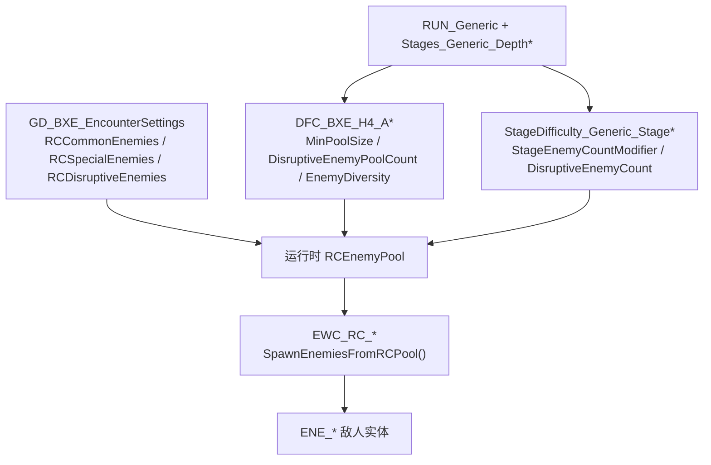

# RogueCore 怪物池分析

> 游戏资源路径：`/Users/bytedance/Project/RogueCore`  
> Mappings：`maps/RogueCore-5.6.1-140986+main-0196ef29.usmap`  
> UE 版本：`VER_UE5_6`  
> 分析产物：`UAssetStudio/analysis/rc_enemy_pool/`

## 概述

RogueCore 任务内的 **RC 怪物池**不是单一 DataAsset 文件，也**不存在**名为 `RCEnemyPool.uasset` 的配置资产（全库 `.uasset` 字面量检索仅命中作弊菜单 UI）。运行时由引擎从多层配置组装 `RCEnemyPool` 结构，波次刷怪通过 `SpawningBlueprintLibrary.SpawnEnemiesFromRCPool()` 从池中抽样。

与 **武器池**（`BXEUnlockPool` / `UP_Weapons_InitialPool`）不同，怪物池基于 `EnemyDescriptor`（`ED_*`）+ `EncounterSettings` + `DifficultySetting` + `StageTemplateDifficulty`。

| 概念 | 实际含义 | 常见误区 |
|------|----------|----------|
| **全局怪物名册** | 本局**允许**进入池的 `ED_*` 列表 | 不是「每局固定刷哪几只」 |
| **RCEnemyPool** | 运行时池（Common / Special / Disruptive 等） | 不是磁盘上的独立资产 |
| **DFC_BXE_H4_A*** | 池规模、多样性、波次间隔 | 不是换怪种类 |
| **StageDifficulty_Generic_Stage*** | 阶段数量/伤害/干扰怪计数修正 | 不含 `ED_*` 列表 |
| **DNA_BXE_Linear_*** | 关卡结构（阶段数、房间标签） | **不**定义怪物种类 |

---

## 架构与数据流

```
任务开始（RUN_Generic + 深度）
  → 选用 DFC_BXE_H4_A1~A4（BaseDifficultyDepth1~4）
  → BP_GameState.CurrentDifficultySetting
  → 读取 GD_BXE_EncounterSettings（全局 ED_* 名册）
  → 结合 StageDifficulty_Generic_Stage*（阶段修正）
  → 组装运行时 RCEnemyPool
  → EWC_RC_* 波次控制器 StartWave()
  → SpawnEnemiesFromRCPool()
  → 生成 ENE_* 实体
```



---

## 一、全局怪物名册（改「能刷哪些怪」）

### 1.1 核心资产

| 资产 | 路径 |
|------|------|
| **★ 主配置** | `Content/Game/GameData/BXESettings/GD_BXE_EncounterSettings.uasset` |
| 基类 | `EncounterSettings`（`/Script/RogueCore`） |

### 1.2 池分类数组

在 `GD_BXE_EncounterSettings` 的 CDO 上维护以下 `EnemyDescriptor` 数组：

| 属性 | 作用 | 当前内容（分析时） |
|------|------|-------------------|
| `RCCommonEnemies` | 常见杂兵 | `ED_CoreSpawn_Creeper` |
| `RCSpecialEnemies` | 精英 / 特殊 | Crawler、Vanguard、Warrior、Scorcher、Swarmer 等 |
| `RCDisruptiveEnemies` | 干扰型 | `ED_CoreSpawn_Edgestalker`、`ED_CoreSpawn_Clamorhead` |
| `StationaryEnemies` | 定点敌人 | CaveLeech、Boomtick Spawner、Thrasher、Slammer 等 |
| `TestEnemies` | 测试用 | `ED_Tester` |
| `CommonCritters` | 小动物 | `CD_LootBug_Expenite` |

**修改方式：** 在对应数组中 **Add / Remove** `ED_*` 引用。新增条目需在资产 imports 中加入对应 `EnemyDescriptor` 包路径。

### 1.3 与 Corespawn 波次的关系

常规波次控制器示例：

| 资产 | 路径 | 刷怪 API |
|------|------|----------|
| 全种类 Corespawn 波 | `Enemies/Waves/WaveControllers/InUse/EWC_RC_Corespawn_All.uasset` | `SpawnEnemiesFromRCPool()` |
| 涓流刷怪 | `Enemies/Waves/WaveControllers/InUse/EWC_RC_EnemyTrickle.uasset` | 同上 |
| 撤离后无限刷怪 | `Enemies/Waves/WaveControllers/InUse/EWC_RC_EndMission_CorespawnEndless.uasset` | 同上 |
| End Mission 触手 | `Enemies/Waves/WaveControllers/InUse/EWC_RC_EndMission_CoreTentacles.uasset` | `SpawnEnemiesAtLocationWithCallback`（固定 `ED_SnakingCoreTentacle`） |

波次控制器**不**维护怪物列表，只触发从运行时 RC 池抽样。

---

## 二、难度因子（改「池多大、多杂、多快」）

> 完整难度分层（DFC、StageDifficulty、Hostile Reading、Run 绑定）见 [`difficulty.md`](./difficulty.md)。

### 2.1 资产

| 资产 | 路径 |
|------|------|
| 深度 1~4 基础难度 | `GameElements/Difficulty/DFC_BXE_H4_A1.uasset` ~ `A4` |
| Run 绑定 | `GameElements/Runs/RUN_Generic.uasset` → `BaseDifficultyDepth1~4` |
| 运行时引用 | `Game/BP_GameState.uasset` → `CurrentDifficultySetting`（默认 `DFC_BXE_H4_A1`） |

### 2.2 关键字段（以 `DFC_BXE_H4_A1` 为例）

| 字段 | 示例值 | 含义 |
|------|--------|------|
| `MinPoolSize` | 7 | 运行时池最少包含的种类数 |
| `DisruptiveEnemyPoolCount` | min = 2 | 干扰怪在池中的数量范围 |
| `EnemyDiversity` | 区间随机 | 多样性权重 |
| `EnemyWaveInterval` | 255–330s | 常规波次间隔（影响 Hostile Reading 圆环图标密度） |
| `EnemyNormalWaveInterval` | 60–120s | 普通波间隔 |
| `EnemyCountModifier` | 按阶段 | 敌人数量倍率 |

详见 [`extraction-countdown.md`](./extraction-countdown.md) 第五节：DFC 影响波次密度，**不是** Hostile Reading 阶段边界时间。

---

## 三、阶段修正（改「当前关卡有多难」）

### 3.1 资产链

```
RUN_Generic
  → StageLayoutForDepth1~4 → Stages_Generic_Depth1~4.uasset
    → 每 Stage 的 StageDifficulty → StageDifficulty_Generic_Stage*.uasset
```

### 3.2 关键字段（以 `StageDifficulty_Generic_Stage2` 为例）

| 字段 | 示例值 |
|------|--------|
| `StageEnemyCountModifier` | 1.4 |
| `StageEnemyDamageModifier` | 1.3 |
| `DisruptiveEnemyCount` | 1 |
| `SpecialEnemyCount` | 2 |
| `StageResistanceModifier_*` | 按体型 |

**不含** `ED_*` 列表；只修正强度与计数，不更换怪物种类。

---

## 四、任务 DNA 与 Run 模板

| 资产 | 路径 | 作用 |
|------|------|------|
| 任务结构 | `GameElements/Missions/BXE_DNA/DNA_BXE_Linear_*.uasset` | `AmountOfStages`、房间 GameplayTag、复杂度 |
| Run 模板 | `GameElements/Runs/RUN_Generic.uasset` | 绑定 DNA、DFC、Boss、生物群系 |
| 任务类型 | `GameElements/Missions/MissionType_BXE.uasset` | GameMode、关卡地图 |
| Run 全局设置 | `GameElements/Runs/RunSettings.uasset` | 生物群系轮换规则 |

`DNA_BXE_Linear_Normal4_Simple` 等资产**没有** `EnemyPool` / `RCEnemy` 字段。

---

## 五、示例：将 `ED_Spider_Grunt` 加入怪物池

### 5.1 资产概况

| 项目 | 情况 |
|------|------|
| 路径 | `Content/Enemies/OLD_Enemies_INUSE/Spider/Grunt/ED_Spider_Grunt.uasset` |
| 类型 | `EnemyDescriptor`（校验 **PASSED**） |
| 是否在现网 RC 池 | **否**（`GD_BXE_EncounterSettings` 无 Spider 条目） |
| 作弊菜单 | `UI/Menus/Menu_Cheats/Cheat_SpawnRCEnemiesMenu` 已引用，可单独生成测试 |
| 默认实体 | `ENE_Spider_Grunt_Normal`（`OLD_Enemies/Spider/Grunt/`） |
| 生物群系变体 | Ice → `ENE_Spider_Grunt_Ice`；Radioactive → `ENE_Spider_Grunt_Radioactive` |
| 体型 | `CreatureSize = Medium` |
| 波次压力 | `CanBeUsedForConstantPressure = true` |

目录名 `OLD_Enemies_INUSE` 表示旧版蜘蛛系仍在使用，但与 RC 主打的 **Corespawn** 敌人系不同，加入后需实机验证平衡与表现。

### 5.2 操作步骤

1. **单独验证（推荐先做）**  
   游戏内打开 `Cheat_SpawnRCEnemiesMenu`，刷 `ED_Spider_Grunt`，确认模型、AI、伤害正常。

2. **加入名册**  
   编辑 `GD_BXE_EncounterSettings.uasset`：
   - 推荐先加入 **`RCCommonEnemies`**（常见杂兵位）
   - 不推荐放入 `RCDisruptiveEnemies`（Grunt 非干扰型设计）

3. **调整出场率（可选）**  
   若进池后很少见到：
   - 增大 `DFC_BXE_H4_A*` 的 `EnemyDiversity` 或 `MinPoolSize`
   - 或从池中暂时移除其它 Common 条目以提高权重

4. **打包**  
   确保 `ENE_Spider_Grunt_*`、`ID_Spider_Grunt` 等依赖随 mod 一起发布。

### 5.3 风险说明

| 风险 | 说明 |
|------|------|
| 题材不一致 | RC Deep Core 关卡以 Corespawn 为主，蜘蛛为旧 DRG 敌人 |
| 池容量竞争 | `MinPoolSize = 7` 限制每局池内种类数，新怪会稀释其它怪权重 |
| 依赖路径 | `ENE_*` 在 `OLD_Enemies/` 下，与 `ED_*` 的 `OLD_Enemies_INUSE/` 路径不同，注意 Cook 完整性 |

**结论：技术上可行；主要风险在玩法与平衡，而非资产不可用。**

---

## 六、与其它系统区分

| 系统 | 配置位置 | 本文是否覆盖 |
|------|----------|--------------|
| RC 波次怪物池 | `GD_BXE_EncounterSettings` + DFC + StageDifficulty | **是** |
| 任务内战斗难度 | `DFC_*` + `StageDifficulty_*` + Run 绑定 | 摘要见上文；详见 [`difficulty.md`](./difficulty.md) |
| 武器池 | `UP_Weapons_InitialPool` 等 | 否 → [`weapon-pool.md`](./weapon-pool.md) |
| Hostile Reading 计时 | `BXE_StageDifficultyProgression_2Step` | 否 → [`extraction-countdown.md`](./extraction-countdown.md) |
| End Mission 触手 | `EWC_RC_EndMission_CoreTentacles` + `ED_SnakingCoreTentacle` | 否（固定敌人，不走 RC 池） |
| Risk Vector | `RV_LethalEnemies` 等 | 通过 Mutator 修正，不替换 `GD_BXE_EncounterSettings` 名册 |

---

## 七、分析命令

从 UAssetStudio 根目录执行：

```bash
export MAPPINGS="maps/RogueCore-5.6.1-140986+main-0196ef29.usmap"
export ASSET_ROOT="/Users/bytedance/Project/RogueCore/Content"
CLI="UAssetStudio.Cli/bin/Release/net9.0/UAssetStudio.Cli.dll"   # 或 dotnet run --project UAssetStudio.Cli --

mkdir -p analysis/rc_enemy_pool

# 全局怪物名册
dotnet "$CLI" json "$ASSET_ROOT/Game/GameData/BXESettings/GD_BXE_EncounterSettings.uasset" \
  --mappings "$MAPPINGS" --ue-version VER_UE5_6 \
  --out analysis/rc_enemy_pool/GD_BXE_EncounterSettings.json

# 难度因子（池规模）
dotnet "$CLI" json "$ASSET_ROOT/GameElements/Difficulty/DFC_BXE_H4_A1.uasset" \
  --mappings "$MAPPINGS" --ue-version VER_UE5_6 \
  --out analysis/rc_enemy_pool/DFC_BXE_H4_A1.json

# Run / 阶段链
dotnet "$CLI" json "$ASSET_ROOT/GameElements/Runs/RUN_Generic.uasset" \
  --mappings "$MAPPINGS" --ue-version VER_UE5_6 \
  --out analysis/rc_enemy_pool/RUN_Generic.json

dotnet "$CLI" json "$ASSET_ROOT/GameElements/Runs/Stages/Stages_Generic_Depth1.uasset" \
  --mappings "$MAPPINGS" --ue-version VER_UE5_6 \
  --out analysis/rc_enemy_pool/Stages_Generic_Depth1.json

# 波次控制器
dotnet "$CLI" decompile "$ASSET_ROOT/Enemies/Waves/WaveControllers/InUse/EWC_RC_Corespawn_All.uasset" \
  --mappings "$MAPPINGS" --ue-version VER_UE5_6 \
  --outdir analysis/rc_enemy_pool

# 待加入池的 ED 校验
dotnet "$CLI" validate "$ASSET_ROOT/Enemies/OLD_Enemies_INUSE/Spider/Grunt/ED_Spider_Grunt.uasset" \
  --mappings "$MAPPINGS" --ue-version VER_UE5_6

dotnet "$CLI" json "$ASSET_ROOT/Enemies/OLD_Enemies_INUSE/Spider/Grunt/ED_Spider_Grunt.uasset" \
  --mappings "$MAPPINGS" --ue-version VER_UE5_6 \
  --out analysis/rc_enemy_pool/ED_Spider_Grunt.json
```

修改资产后可用 `compile` + `verify` 做往返二进制校验（需保留原始 `.uasset` 作链接基准）。

---

## 八、关键资产索引

```
Content/
├── Game/
│   ├── BP_GameState.uasset                         # CurrentDifficultySetting
│   ├── GM_BXE.uasset                               # EnemyWaveManager、TriggerNewDifficulty
│   └── GameData/
│       ├── GD_EnemySettings.uasset
│       └── BXESettings/
│           ├── GD_BXE_EncounterSettings.uasset     # ★ RC 怪物名册
│           └── GD_BXESettings.uasset               # RunSettings、RiskVector 等
├── GameElements/
│   ├── Difficulty/
│   │   ├── DFC_BXE_H4_A1~A4.uasset                 # ★ 池规模 / 波次间隔
│   │   └── BXE_StageDifficultyProgression_2Step.uasset
│   ├── StageDifficulty/
│   │   └── StageDifficulty_Generic_Stage*.uasset     # ★ 阶段强度修正
│   ├── Runs/
│   │   ├── RUN_Generic.uasset                      # 深度 → DFC / Stages
│   │   ├── RunSettings.uasset
│   │   └── Stages/Stages_Generic_Depth*.uasset
│   └── Missions/
│       └── BXE_DNA/DNA_BXE_Linear_*.uasset         # 关卡结构（非怪物池）
└── Enemies/
    ├── Waves/WaveControllers/InUse/
    │   ├── EWC_RC_Corespawn_All.uasset             # SpawnEnemiesFromRCPool
    │   ├── EWC_RC_EnemyTrickle.uasset
    │   ├── EWC_RC_EndMission_CorespawnEndless.uasset
    │   └── EWC_RC_EndMission_CoreTentacles.uasset  # 固定触手，不走池
    ├── CoreSpawn/.../ED_CoreSpawn_*.uasset         # 现网池内敌人
    └── OLD_Enemies_INUSE/Spider/Grunt/
        └── ED_Spider_Grunt.uasset                  # 示例：可加入池的旧版蜘蛛
```

---

## 九、修改目标速查

| 目标 | 修改位置 |
|------|----------|
| 增加 / 移除可刷怪物种类 | `GD_BXE_EncounterSettings` → `RCCommonEnemies` / `RCSpecialEnemies` / `RCDisruptiveEnemies` |
| 让池更大、干扰怪更多 | `DFC_BXE_H4_A*` → `MinPoolSize`、`DisruptiveEnemyPoolCount` |
| 让第 N 关更难（数量/伤害） | `StageDifficulty_Generic_StageN` |
| 改特定波次行为 | `EWC_RC_*` 波次控制器 |
| 改关卡层数 / 房间 | `DNA_BXE_Linear_*`（**不是**怪物池） |
| 加入 `ED_Spider_Grunt` | `RCCommonEnemies` + 实机测试（见第五节） |
